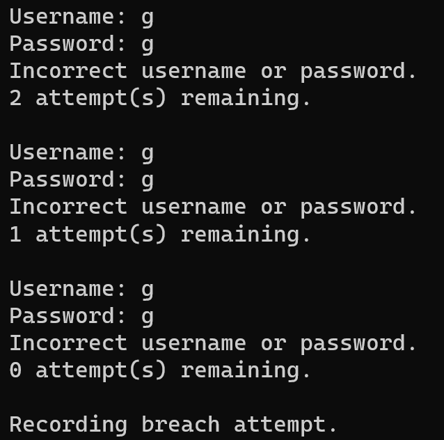
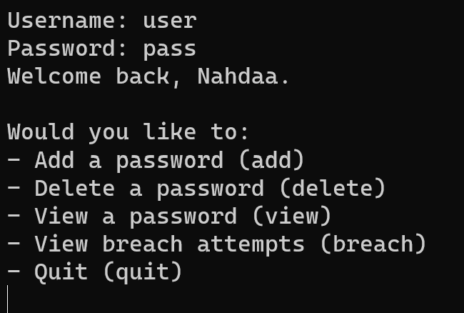
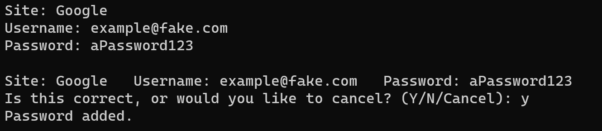
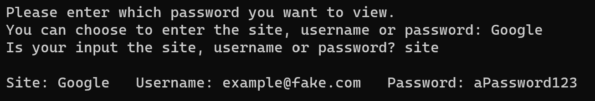
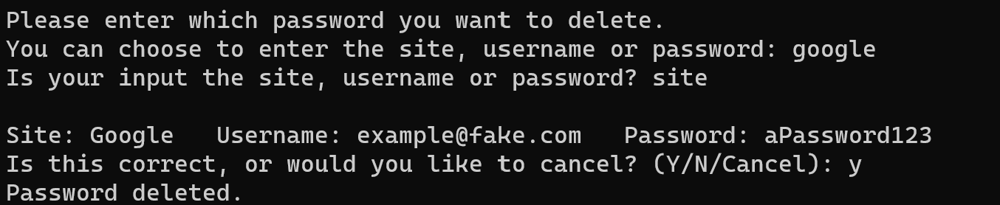
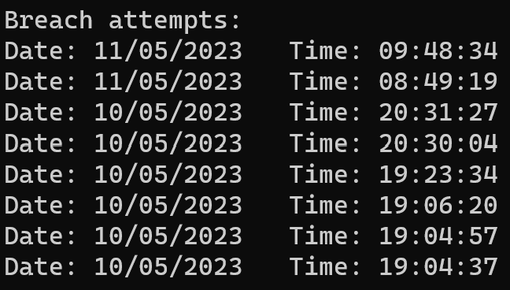

# PasswordManager_CSharp

  
Table of Contents

  <ol>
    <li><a href="#about-the-project">About The Project</a>
      <ul>
        <li><a href="#features">Features</a>
          <ul>
            <li><a href="#add-a-password">Add a Password</a>
            <li><a href="#delete-a-password">Delete a Password</a>
            <li><a href="#view-a-password">View a Password</a>
            <li><a href="#view-breaches">View Breaches</a>
          </ul>
      </ul>        
    <li><a href="#built-with">Built With</a></li>
    <li><a href="#challenges">Challenges</a></li>
    <li><a href="#future-changes">Future Changes</a></li>
    <li><a href="#contact">Contact</a>
  </ol>

## About the Project
This password manager project was created to practice my recently-learned skills in C# and MySQL. 
It was created as a console app on Microsoft Visual Studio.
I attempted to create a software requirements document. You can read the document [here](https://docs.google.com/document/d/1VoshevUizADNLQpCg6mlBYxpclz_hwme3RAi3Ye_m_E/edit?usp=sharing).

At the beginning, the program prompts you to input a master username and password to access the services in the password manager. The user is given 3 tries to input this correctly, otherwise the program logs it as a 'breach' and records the time of the breach in a database.

  

### Features
When the master password and username is entered correctly, the program displays the menu.

  

#### Add a Password
The program gives the user the ability to add a password to the database. They are prompted to enter a site, username and password. 
Null or empty values throw an exception so that they are not passed through the class method into the database.
The user is asked to confirm their input, giving the user a chance to continue, re-enter or cancel.

  

#### View a Password
The program allows the user to view the password row they specify. The program first checks if their input exists in the database. If not, they are prompted to re-enter. If the row does exists, it is displayed on the console.

  

#### Delete a Password
The program gives the user the ability to delete a password that exists in the database. They are prompted to input either the site, username or password. The program initially searches the database to see if the input exists. If it doesn't exist, the program tells the user and prompts them to re-enter.
Otherwise, the program displays the row in the database and asks for user confirmation. 

  

#### View Breaches
The program produces a list of all existing breaches. The list starts from the most recent breach then descends down to the oldest. The list is displayed on the console.

  

## Built With
This project was built using the following technologies and languages:
- C#
- .NET
- Microsoft Visual Studio
- MySQL

## Challenges
### Problem
This was my first project using object-oriented programming and MySQL. At first, I struggled with the concept of classes and objects, and did not understand where to implement the logic and the execution. I was also trying to implement MySQL from the very start, which confused me even more.

### Solution
After I realised I was struggling, I decided to take a step back and study a bit more about OOP and how to implement it, then started the project from square one.
This time I worked on one method at a time instead of all of them at once. I used a .txt file instead of a database at first to check if my methods were working correctly. After I confirmed they worked, I implemented the MySQL database.

## Future Changes
In the future I would like to implement a GUI for this program, so that the user doesn’t need to have Microsoft Visual Studio or any sort of understanding of C#.
For this project, I also used a local database on the MySQL workbench. In the future, I would like to use a server database so that users don’t have to download MySQL and create the database.

## Contact

  <a href="https://www.linkedin.com/in/nahdaa-jawed/">My LinkedIn</a>

